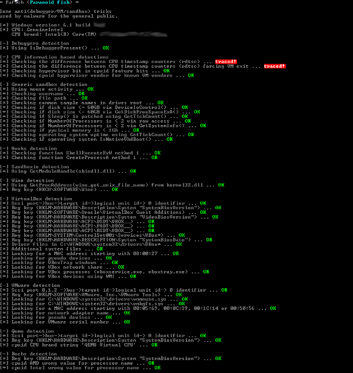

# Antivmdetection

# Background:

A script to help you create templates, which you can use with VirtualBox to make VM detection harder.

My first post on the subject was in 2012 and have after that been updated at random times. The blog format might have not been the best way of publishing the information and some people did make nice and "easy to apply" script based on the content.

As a way to make it easier for me to add new content, I have decided to do the very same.

The purpose of this script is to use, available settings without modifying the VirtualBox base. There are people who do really neat things by patching Virtualbox. But that is out of the scoop for this script. I think this approach has some merits as it does not (hopefully) break with every new release of VirtualBox. 
Overtime I have also included "things" that are not directly VM related, but rather things that malware is using to fingerprint installations, I hope you don't mind..

The main script will create the following files: 

* One shell script, that can be used as a template, to be used from the host OS and applied to the VM that you like to modify. 
* A dump of the DSDT, that is used in the template script above. 
* A Windows Powershell file to be used inside the guest, to handle the settings that is not possible to change from the host. This script will have to be run twice, one for the changes that requires reboot and the second time for the pesky things that resurface at reboot. 

# Notes:

* When the antivmdetect script can't find any suitable values to use, it will comment these settings in the newly created script, with a "#". These needs manual review as they might have impact on what is displayed in the VM.
* Create the VM, Verify that "I/O APIC" is enabled (system > Motherboard). But don't start it, also exit the VirtualBox GUI. The shell script needs to be run before installation!. 
* The script expects that the storage layout to look like the following:
       + IDE: Primary master (Disk) and Primary slave (CD-ROM)
       + SATA: Port 0 (Disk) and Port 1 (CD-ROM)
* Run the shell script to apply the setting to the guest 
* Install the Windows Operating System (so far only tested on XP and W7) 
* Move the batch script to the newly installed guest.
* Run the batch script inside the guest. Remember that most of the settings that gets modified, are reverted after each reboot. So make it run at boot if needed. 
    + As of version 0.1.4, some applied settings will require a reboot. So run the batch script once, the guest will be rebooted. Then run the script once again to finalize the setup.  
* Before you apply the batch script inside the guest, please disable UAC (reboot required) otherwise you will not be able to modify the registry with the script.
* For Windows 10 users:  run the PS script as an administrator (right-click on the cmd.exe -> run as admin, navigate to the PS script and execute)
+ If applied correctly, a Pafish run will result in this (no need to modify Virtualbox). 

+ Please note, that this script does other things that is not covered by Pafish (for example W10 artifacts)

# Version History:

* 0.1.7:
    + Windows 10 is now supported (feedback welcome)
    + Several new artifacts "corrected" for W10 installations 
    + New dependency: mesa-utils
    + Merged bug fix from @Fullmetal5 (#10)
    + Misc code fix 
    + Updated the readme

* 0.1.6:    
    + Added a pop-up after the second run, to make it more clear that you are good to go
    + Added a function that spawns a few instances of notepad, this feature will be extended in future versions
    + Reworked the RandomDate function, thanks to @Antelox for making me aware of the issue with the old one (#8) 
    + Acpidump shipped with older versions of Ubuntu, does not support the "-s" switch. This is now handled with an error message. Thanks to @Antelox for this issue (#7) 
    + Devmanview.exe was not removed after the second run, fixed

* 0.1.5:
    + Added support for associating and de-associating (default disabled) file extensions. Reference: https://www.proofpoint.com/us/threat-insight/post/massive-adgholas-malvertising-campaigns-use-steganography-and-file-whitelisting-to-hide-in-plain-sight
    + Added support for user supplied clipboard buffer. If not present a random string will be generated. Fill the file with Honeytokens of your choice 
    + Removed XP support 
    + Converted the batch script sections to Powershell. Moved more logic to the guest script, in short there is less reason to create/re-generate the template often, as more items are randomized on the guest.
    + Added a function that randomizes the Desktop background image
    + Added a function that creates documents of "all" sorts on the guest
    + Added a function that creates documents of "all" sorts on the guest and moves them to the recycle bin
    + Randomizing the DigitalProductId in two more locations:
      + HKEY_LOCAL_MACHINE\SOFTWARE\Microsoft\Internet Explorer\Registration\DigitalProductId.		
	  + HKEY_LOCAL_MACHINE\SOFTWARE\Microsoft\Windows NT\CurrentVersion\DefaultProductKey\DigitalProductId.
    + Use paravirtualization Interface: None (verified with VBox 5.1.4) - Check updated to reflect this change. I assume this change in VBox came about thanks to: TiTi87, thanks!

* 0.1.4:
    + Fixed a bug for users of python-dmidecode 3.10.13-3, this one was all me..
    + Added a function that randomizes VolumeID (new prerequisite: VolumeID.exe), this information is for example collected by Rovnix 
    + Added a function that randomizes username and computername/hostname (new prerequisites: list of usernames and computernames) 
    + First attempt to add information to the clipboard buffer, idea (command) came from a tweet by @shanselman . Will be improved in the next release
    + Updated the readme: new dependencies and new features that requires reboot 

* 0.1.3:
    + Copy and set the CPU brand string. 
    + Check if an audio device is attached to the guest. Reference: http://www.joesecurity.org/reports/report-61f847bcb69d0fe86ad7a4ba3f057be5.html
    + Check OS architecture vs DevManView binary.
    + Randomizing the ProductId in two more locations: 
	    + HKEY_LOCAL_MACHINE\SOFTWARE\Microsoft\Internet Explorer\Registration\ProductId.		
	    + HKEY_LOCAL_MACHINE\SOFTWARE\Microsoft\Windows NT\CurrentVersion\DefaultProductKey\ProductId.
    + Purge the Windows product key from the registry (to prevent someone from stealing it...).
    + Edit the DigitalProductId (HKEY_LOCAL_MACHINE\SOFTWARE\Microsoft\Windows NT\CurrentVersion\DigitalProductId) to match the new ProductId.
* 0.1.2:
    + Check if the Legacy paravirtualization interface is being used (Usage of the Legacy interface will mitigate the "cpuid feature" detection).
* 0.1.1:
    + Check for CPU count (Less than 2 == alert).
    + Check for memory size (Less than 2GB == alert).
    + Check if the default IP/IP-range is being used for vboxnet0 (You can ignore the notification if you don't use it). 
    + Randomizing the ProductId.
    + Merged PR #3 from r-sierra (Thanks for helping out!
    + Fixed a bug in the AcpiCreatorId (Thanks @Nadacsc for reporting it to me!).
    + Fixed a bug in the DmiBIOSReleaseDate parsing.
    + Fixed a bug in DmiBIOSReleaseDate, to handle both the "default" misspelled variant and the correctly spelled one (Thanks @WanpengQian for reporting it to me!).
    + The DevManView inclusion did not work as expected, It should be fixed in this release. 
    + Supports SATA controller as well (Previously only IDE settings was modified)
    + Updated the readme
* 0.1.0: 
    + Resolved the WMI detection make famous by the HT. Added DevManView.exe (your choice of architecture) to the prerequisites.
* < 0.1.0 No version history kept, need to start somewhere I guess.

/Mikael

Feedback is always welcome! =)

